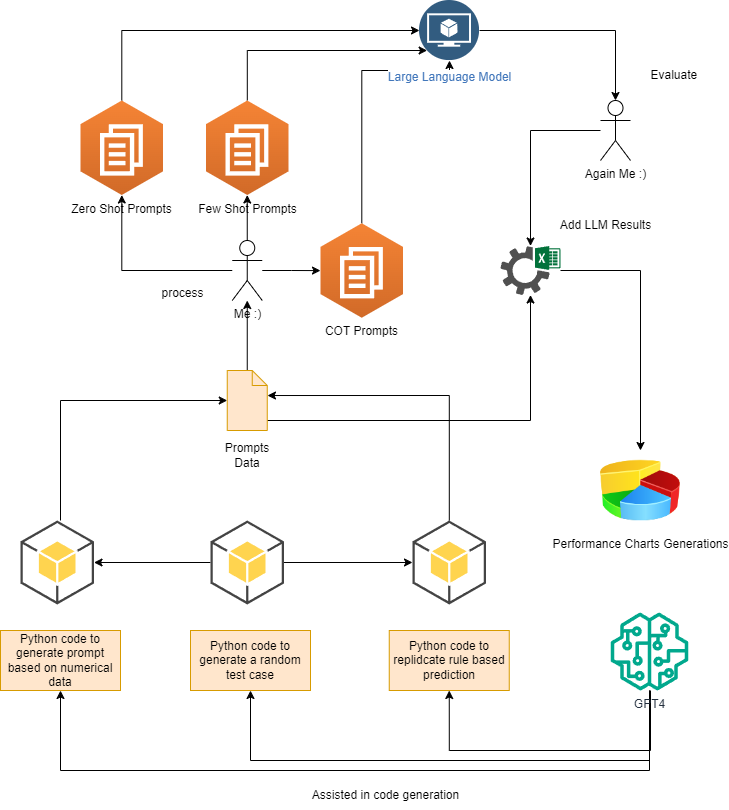
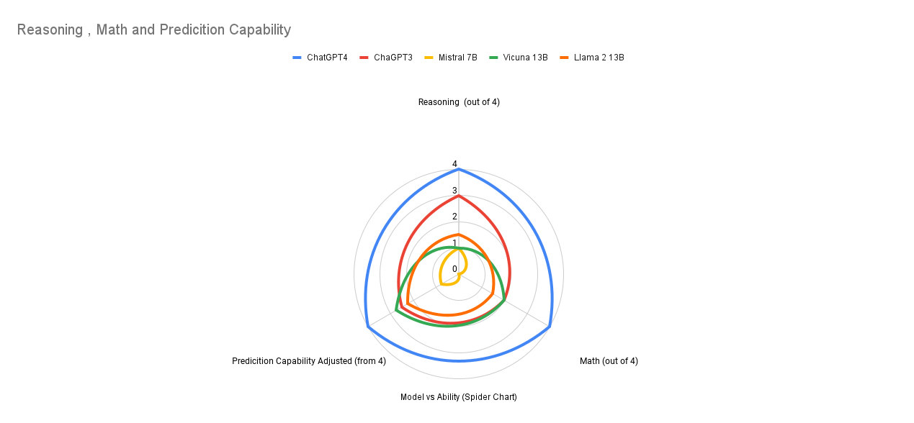
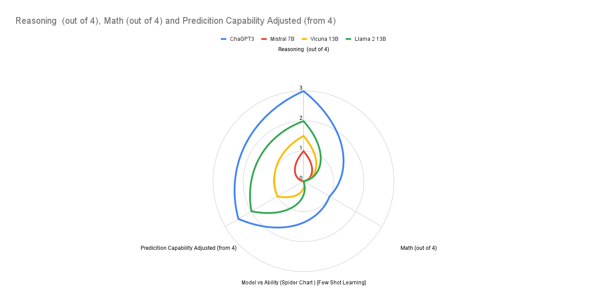
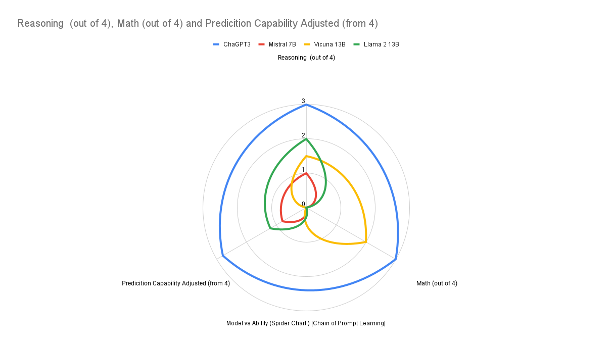

# Applied AI Project Report on Actuated Traffic Signal Control System using Large Language Models

## Overview
The project, presented for CS514 Applied AI, focuses on the development of an Actuated Traffic Signal Control System utilizing Large Language Models (LLMs). The primary objective is to enhance traffic signal control by incorporating advanced AI models, particularly for decision-making in traffic signal operations.

## Traffic Signal Control: Traditional Approach and AI Integration

Traditionally, traffic signals operate on a round-robin control mechanism in countries like India, however in the US the traffic signal work in a different way, the gif below showcases how they work. 

In India, traffic signals typically follow a round-robin sequence, allowing each direction to proceed one at a time. In contrast, the U.S. employs more complex signal phases that enable multiple traffic movements simultaneously, such as dedicated phases for north-south and east-west through traffic, as well as specific turns, optimizing flow and reducing wait times at intersections.

This GIF helps in understanding the environment and the possible outputs:

> Source: [How Do Traffic Signals Work?](https://www.youtube.com/watch?v=DP62ogEZgkI)

For PDF format the most important part of the GIF is shown below:

This project aims to revolutionize traffic signal approach by integrating AI, particularly Large Language Models. The AI-based system considers various factors at each direction end, including the number of vehicles waiting, pedestrian traffic, emergency vehicles presence, public transport schedules, and busy street events.

## Evaluation of Large Language Models
The project evaluated different LLMs, including:
- Mistral Instruct 7B
- GPT-4
- Vicuna 13B
- GPT-3.5
- Llama 2 13B

These models were tested on their ability to predict which traffic signal to open based on vehicle count at each signal. Different prompting strategies like Zero Shot, Few Shot, and Chain of Thought were utilized.

A custom traffic environment simulator was created for this project specifically to generate prompts for the LLMs. The simulator generates random traffic conditions and prompts the LLMs to predict which signal to open. The environment contains 2 modes - Round Robin Mode and North American Mode. The Round Robin Mode is similar to the traditional traffic signal control system in India, where each direction is given a chance to go one at a time. The North American Mode is similar to the traffic signal control system in the US, where multiple directions can go at the same time. The simulator also has the option to generate prompts for both modes.

The correct output is determined by outputs of previous projects where we created rule based systems, bayesian networks and influence diagrams to find out which is the best signal to open. The outputs of these projects are used as the ground truth to compare the LLMs performance.

## Prompt Generation

The environment consists of 4 roads, each with 2 lanes. The lanes are direction protected (left lane goes left, right can go through or right). There are 4 directions:
1. North
2. South
3. East
4. West

Each direction end has the following properties:
- Number of Vehicles waiting for through or right
- Number of Vehicles waiting for left
- Cycles since last waiting vehicle arrived left
- Cycles since last waiting vehicle arrived through or right
- Number of pedestrian waiting on parallel lane
- Cycles since last pedestrian arrived
- Emergency vehicles for through or right
- Emergency vehicles for left

> Code can be found in [trafficEnv.py](./scripts/trafficenv.py)

The environment is initialized with random values for each of the properties. The environment data is then passed as textual prompt to the LLMs to predict which signal to open. The LLMs are given the following prompt:

- Zero shot prompt - [ZeroShotPrompts.md](./prompts/ZeroShotPrompts.md)
- Few shot prompt - [FewShotPrompts.md](./prompts/FewShotLearning.md)
- Chain of thought prompt - [ChainOfThoughtPrompts.md](./prompts/ChainOfThoughPrompting.md)

## Methodology

- Zero-Shot Learning: Involves prompting the model without prior context or examples.
- Few Shot Learning: The model is provided with a few examples to guide its responses.
- Chain of Thought Prompting: The model is prompted to think through a problem step-by-step.

The output of LLMs is compared to the output of rule-based systems to evaluate their performance.

The code to determine correct out can be found in [trafficEnv.py](./scripts/trafficenv.py)

### Testing and Evaluation Setup

### Step 1: Python Code Integration
- Python code is used to generate prompt data based on numerical data.
- Another set of Python code generates a random test case to challenge the model.
- Finally, Python code is also used to replicate rule-based prediction, presumably to compare with the LLM's performance.
 
### Step 2: Prompt Generation
Three types of prompts are generated for the LLM:
- **Zero Shot Prompts:** These are prompts given to the model without any prior context or examples.
- **Few Shot Prompts:** These prompts provide the model with a few examples to guide its responses.
- **Chain Of Thought (COT) Prompts:** This approach involves prompting the model to process the problem step-by-step, simulating a thought process.

### Step 3: Large Language Model Processing
The generated prompts are fed into a Large Language Model (LLM) to evaluate its performance on various tasks.

### Step 4: Evaluation
The output from the LLM is evaluated to assess the model's effectiveness.

### Step 5: Iterative Refinement
If the evaluation requires, the process is iterated with the addition of the LLM's results to refine the prompts further.

### Step 6: Performance Analysis
Performance charts are generated to visualize the effectiveness of the model based on the given prompts.

### Evaluations

The conversations on which the llms were tested can be found in [conversations](./llm_chats/) folder. The evaluation results can be found in the following [excel sheet](./Evaluating_LLMs_for_Traffic_Control.xlsx). The project was also presented in the class, the presentation can be found [here](./LLMS_for_Traffic_Control_Presentation.pdf).

## Results

### Zero Shot Prompting

### Few Shot Prompting

### Chain of Thought Prompting

## Discussion

GPT4 is the best model for this task, it is able to generate the correct output using proper logic in zero shot prompting itself. Other models try to use some math in zeroshot prompting but fails to get the logic to do the math right. When we add some more information to the prompt but not math, all the models try to replicate that and try to reason without using math and suffer in the math scores but their reasoning does improve a bit. When we add math to the prompt finally in the chain of thought prompting, high parameter models such as GPT3.5 and Vicuna 13B are able to do the math correctly. In case of GPT3.5 the reasoning is good but Vicuna's reasoning is still pretty mediocre. GPT4 is able to do the math correctly and also reason correctly. It is also able to deal with other information such as emergency vehicles, pedestrian traffic, city transit schedules, and busy street events.

### Future Improvements
- **Model Optimization**: Considering the size of GPT-4, a smaller model could be fine-tuned and trained to work with a particular prompting method, which may be more practical for traffic scenarios.
- **Fine-tuning for Specific Tasks**: GPT-3.5 showed improved performance with Chain of Thought prompting; refining this could make it a strong candidate for traffic management applications.
- **Focus on Prediction**: Removing unnecessary capabilities, such as speech, to focus solely on prediction could reduce the model size and improve efficiency.
- **Integration with Actionable Agents**: Pairing the model with an agent capable of taking actions could lead to more effective implementations and results.

### Pros
1. **Versatility**: GPT-4 offers a versatile approach to managing signals, capable of adapting to various scenarios like busy streets and public transit schedules.
2. **Handling Unpredictable Events**: It has the potential to handle unpredictable events better than rule-based systems.
3. **Incorporating New Knowledge**: GPT-4 can easily integrate new information and adapt its operations accordingly.

### Cons
1. **Unpredictable Outputs**: The model's temperature-based predictions can lead to unpredictable output formats.
2. **Impractical Size**: GPT-4 is large, making its use for traffic management at a single intersection impractical with current technology.

### Why GPT-4
GPT-4 was chosen over other models due to its superior performance in versatility, adaptability, and ability to handle complex and unpredictable traffic scenarios. Its advanced natural language understanding allows it to process and integrate new information efficiently, making it suitable for dynamic environments like traffic management. However, its size may necessitate the consideration of smaller, more specialized models for practical deployment.

## Conclusions
The project demonstrates the potential of Large Language Models in traffic signal control, highlighting their advantages over traditional systems. Future improvements may include optimizing model size, fine-tuning smaller models for specific tasks, and integrating the model with an agent for action-taking.

The project's success with GPT-4 opens avenues for further research and practical application in traffic management and other real-world scenarios where AI can play a transformative role.
